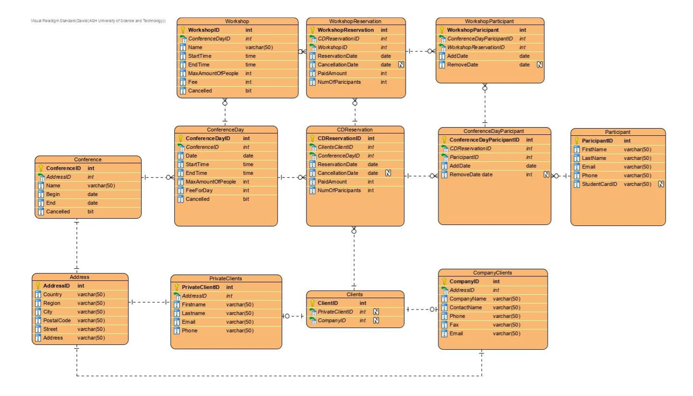

# Conference database

Project created as a part of database-systems I  classes at AGH UST.

The objective of this project was to create an entire database that will manage the organization of
various conferences - it required designing the database schema, ensuring database data integrity and implementing
triggers, views, procedurs and functions using SQL.

The data was generated using a data generator written in C++.

